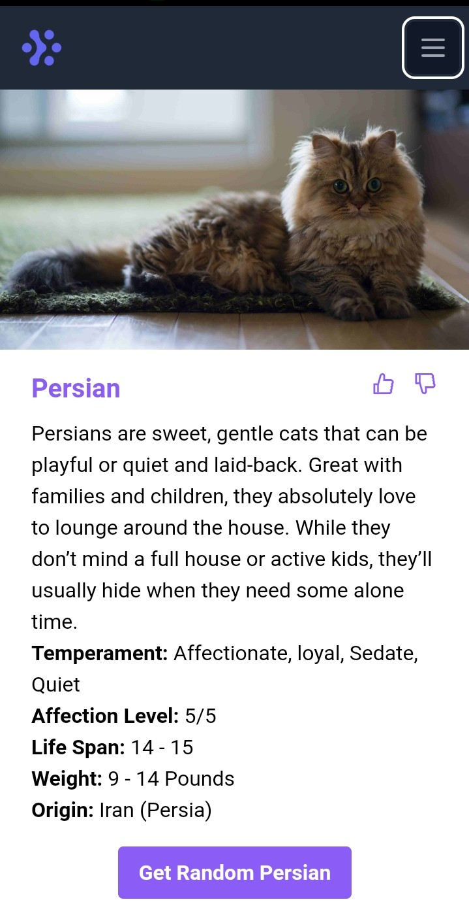
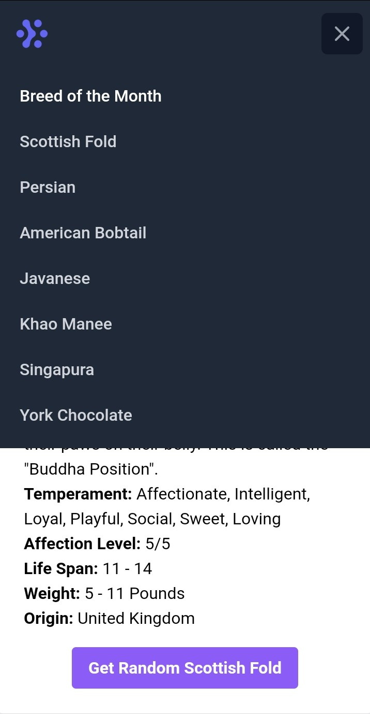

# Tinder App is a responsive App/Site made with React and TailwindCSS 
[](https://app.netlify.com/sites/gittedtinderapp/deploys)
<p align="flex">
  
  
</p>

### Deployed at:

```
gittedtinderapp.netlify.com
```

### src folder structure
```
src/
  assets/
    main.css
    tailwind.css
  components/
    ...
  App.css
  App.js
  index.css
  index.js
```

## Usage

### Install dependencies

```
npm install
npm i json-server
npm i react-router-dom
npm i -D tailwindcss@latest postcss@latest autoprefixer@latest postcss-cli@latest
npx tailwind init tailwind.js --full
npm i @headlessui/react
npm i react-icons
```

### Run React dev server

```
npm run start
```

### Setup its routing for netlify deployment
```
Create a file in the root directory called _redirects
Copy this inside the_redirects file:
  # Redirect with a 301
  /*  /index.html   200
Add this line to the build script line in package.json
  && cp _redirects build/_redirects
```

### To build for production

```
npm run build
```

## How It Was Built

### Create React App

```
npx create-react-app 
```